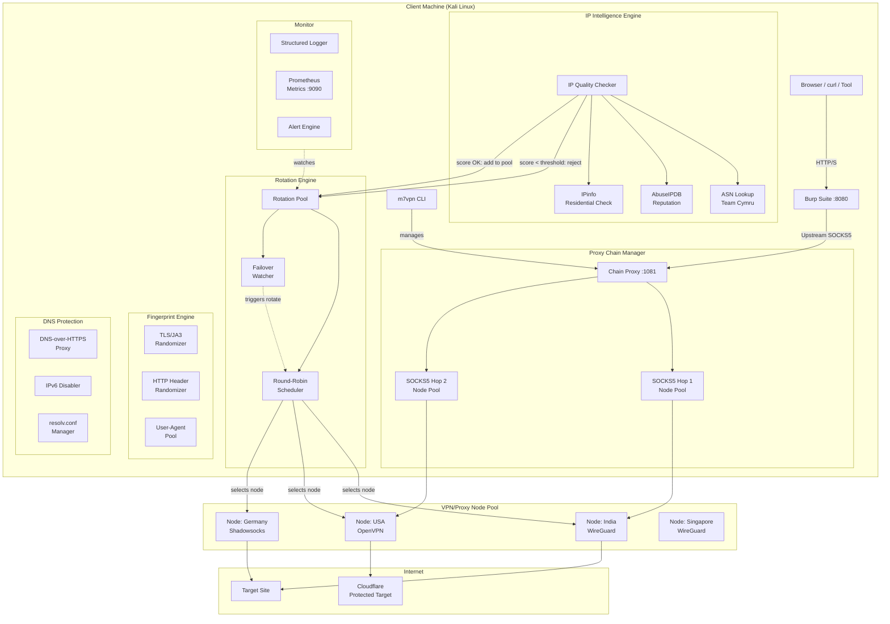

# M7VPN v2 — Architecture Design Document

> Made by Milkyway Intelligence | Author: Sharlix
> For authorized security research and bug bounty testing ONLY.

---

## Executive Summary

M7VPN v2 upgrades the existing VPN tool into a full **IP-quality-aware, rotation-capable, leak-proof** proxy orchestration framework for authorized penetration testers and bug bounty researchers. The core problems solved are:

| Problem | Solution |
|---|---|
| Datacenter IPs blocked | IP Intelligence Engine filters by ASN/abuse score |
| Static identity | Rotation Engine rotates per-request or per-session |
| DNS/IPv6 leaks | Hardened DNS + IPv6 complete block |
| TLS fingerprint detection | JA3/HTTP fingerprint randomizer |
| No Burp integration | SOCKS5 chain manager with Burp upstream support |
| No visibility | Prometheus + structured logging |

---

## High-Level Architecture (Mermaid)



---

## Module Breakdown

### 1. IP Intelligence Engine (`intel/`)

**Purpose:** Score every candidate IP before adding it to the rotation pool.

**Data sources:**
- **Team Cymru** — ASN lookup via DNS (`whois.cymru.com`). Identifies hosting/datacenter ASNs.
- **AbuseIPDB** — Abuse confidence score (0–100). Reject anything >20 for clean testing.
- **IPinfo** — `usage_type` field: `hosting`, `isp`, `residential`, `mobile`. Prefer `residential` or `mobile`.

**Scoring algorithm:**
```
score = 0
if ASN in DATACENTER_ASN_LIST: score += 50
if abuse_confidence > 20:        score += 30
if usage_type == "hosting":      score += 20
if usage_type == "residential":  score -= 20
if abuse_confidence == 0:        score -= 10

ACCEPT if score < 30
REJECT  if score >= 30
```

---

### 2. Rotation Engine (`rotation/`)

**Modes:**
- `per-request` — new IP every HTTP request (via SOCKS5 pool)
- `per-session` — sticky IP for a session, rotate on failure
- `timed` — rotate every N seconds

**Pool management:**
- Min pool size: 3 healthy nodes
- Health check: TCP probe every 30s
- Failover: automatic on 2 consecutive failures
- Cooldown: used nodes go into 5-min cooldown before re-use

---

### 3. Proxy Chain Manager (`chain/`)

**Burp Suite integration flow:**
```
Browser → Burp (127.0.0.1:8080) → Chain Proxy (127.0.0.1:1081) → Node Pool → Target
```

**Burp configuration:**
- Settings → Network → Connections → SOCKS Proxy
- Host: `127.0.0.1`, Port: `1081`

**Supports:**
- Single-hop SOCKS5
- Double-hop (SOCKS5 → SOCKS5)
- HTTP CONNECT chains

---

### 4. Fingerprint Engine (`fingerprint/`)

**TLS fingerprint:**
- Randomize cipher suite order
- Vary TLS extensions presence/order
- Use `curl-impersonate` or `tls-client` Python library for Chrome/Firefox JA3

**HTTP fingerprint:**
- Rotate User-Agent (pool of 50+ real browser UAs)
- Randomize `Accept-Language`, `Accept-Encoding`
- Vary header order (matches real browser behavior)
- Random `sec-ch-ua` and related headers

---

### 5. DNS & IPv6 Leak Protection (`dns/`)

**DNS hardening:**
1. Set `/etc/resolv.conf` to `1.1.1.1` / `8.8.8.8` pre-connect
2. iptables rule: redirect all UDP/53 to tunnel
3. Block DNS outside tunnel: `iptables -A OUTPUT -p udp --dport 53 ! -o <tun_iface> -j DROP`

**IPv6 complete block:**
```bash
sysctl -w net.ipv6.conf.all.disable_ipv6=1
sysctl -w net.ipv6.conf.default.disable_ipv6=1
ip6tables -P INPUT DROP
ip6tables -P OUTPUT DROP
ip6tables -P FORWARD DROP
```

---

### 6. Monitoring (`monitor/`)

**Metrics exposed (Prometheus):**
- `m7vpn_requests_total` — counter by node/status
- `m7vpn_node_latency_ms` — histogram
- `m7vpn_pool_size` — current healthy pool size
- `m7vpn_rotations_total` — how many times rotated
- `m7vpn_ip_score` — current node's reputation score

**Alerts:**
- Pool size < 2: critical alert, halt traffic
- Latency > 2000ms: warn, consider rotation
- Abuse score > 20: remove node from pool

---

## Implementation Priority

| Priority | Task | Effort |
|---|---|---|
| P0 | DNS/IPv6 leak fix | 2h |
| P0 | IP Intelligence Engine | 4h |
| P1 | Rotation Engine | 6h |
| P1 | Chain Proxy Manager | 4h |
| P2 | Fingerprint Engine | 4h |
| P2 | Monitoring/Prometheus | 3h |
| P3 | VPS Auto-provisioning | 8h |

---

## Test Plan

### Unit Tests
- `intel/`: mock AbuseIPDB/IPinfo responses, verify score calculation
- `rotation/`: verify round-robin, failover triggers, cooldown logic
- `chain/`: verify SOCKS5 forwarding, chain construction
- `dns/`: verify resolv.conf written, iptables rules applied

### Integration Tests
- Full connect → verify public IP changed via `api.ipify.org`
- DNS leak test: `curl https://dnsleaktest.com` via tunnel
- IPv6 leak: `curl -6 https://ifconfig.co` should fail
- Rotation: 10 requests, verify ≥2 different IPs used

### Live Burp Test
1. Start m7vpn: `sudo m7vpn -c india --chain --burp`
2. Configure Burp upstream: Settings→Network→SOCKS Proxy→127.0.0.1:1081
3. Send request via Repeater to `https://httpbin.org/ip`
4. Verify IP shown is VPN node IP, not real IP

---

## Ethical & Legal Constraints

- **Only test targets you have explicit written authorization to test**
- Respect bug bounty program scope and rules
- Do not use residential proxy features against targets that prohibit automated testing
- Collect no sensitive user data from target sites
- All features are for authorized penetration testing and security research only
